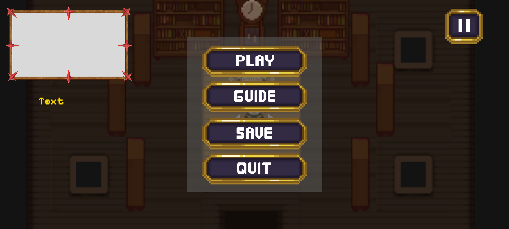
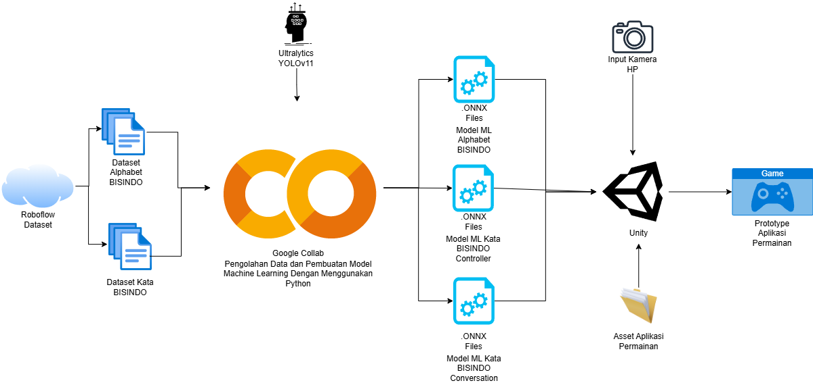
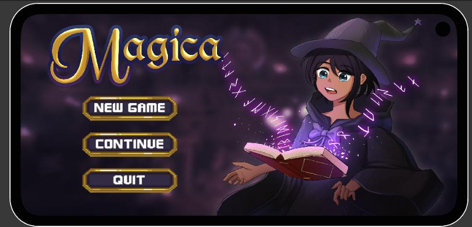
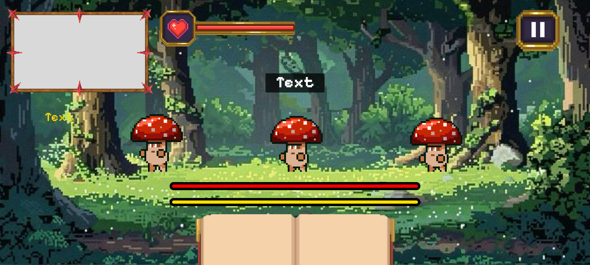
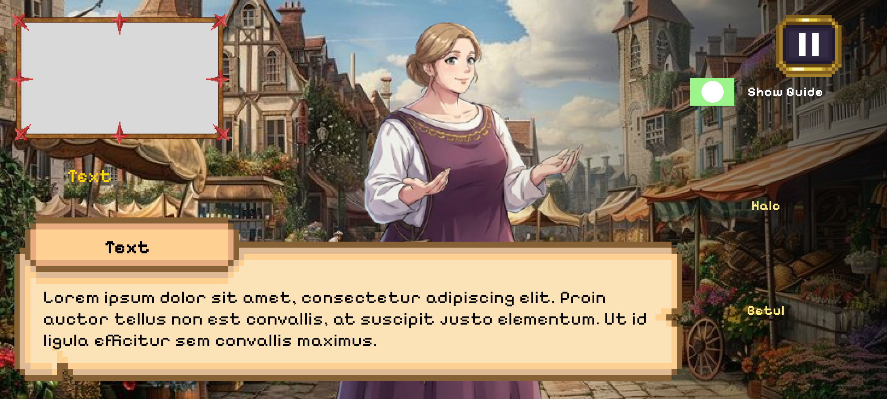
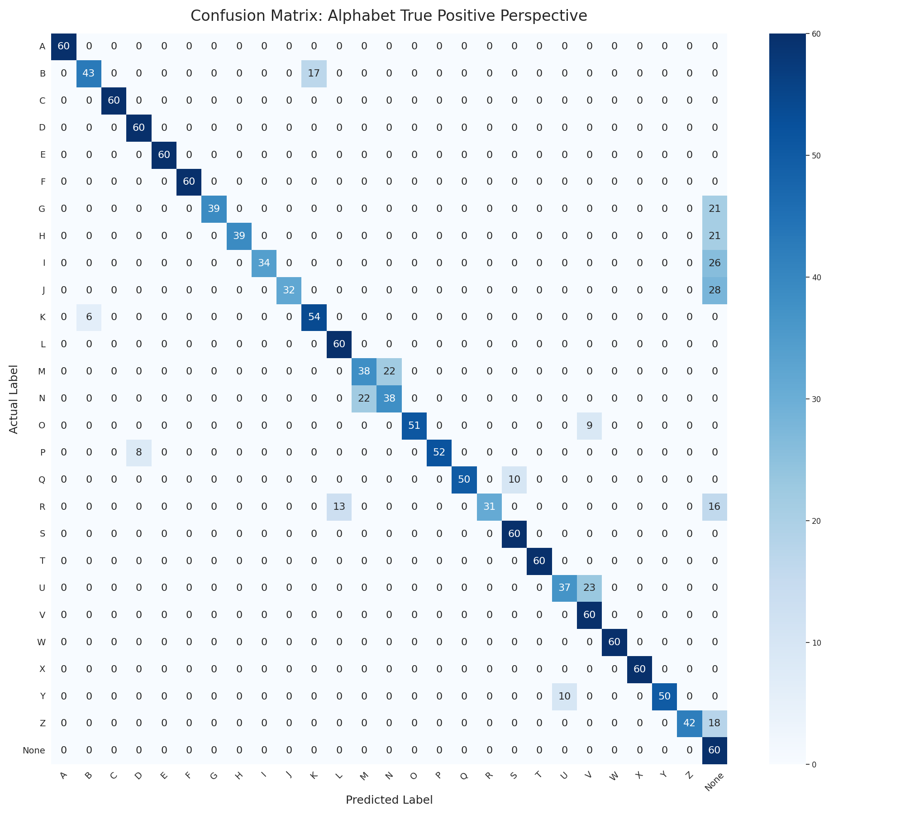
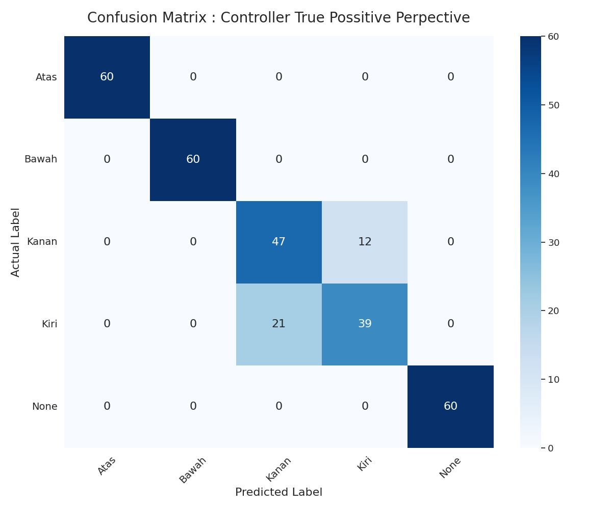

# Magica

A 2D RPG educational game built with Unity 6 that uses real-time hand gesture recognition (sign language) as its primary input mechanism. Players navigate the world, battle enemies, and interact with NPCs by performing hand signs detected through the device camera using ONNX machine learning models.



## Overview

Magica teaches sign language through gameplay. Instead of traditional touch or controller input, players use hand gestures captured by the device camera. The game uses YOLO-based object detection models running on-device via Unity's Inference Engine to recognize signs in real time.

### 🎥 Gameplay Trailer
Check out the early gameplay demo and computer vision integration here:  
👉 **[Watch the Demo on YouTube](https://youtu.be/1A46_NO6304)**

## Arsitektur Aplikasi



## Gameplay Features

### Hand Gesture Movement

Navigate a node-based 2D map by signing directional gestures:
- **Atas** (Up), **Bawah** (Down), **Kanan** (Right), **Kiri** (Left)



### Spell-Casting Battle System

Turn-based combat where players sign alphabet letters (A-Z) to cast spells before the enemy's attack timer fills. Features:
- 3 difficulty chapters, each introducing new letters
- 7-wave battles per chapter
- Star rating system (1-3 stars based on remaining HP)
- Boss battles with unique mechanics




### NPC Conversation System

Interact with NPCs using conversational sign language gestures:
- **Halo** (Hello), **Terima Kasih** (Thank You), **Ambil** (Take), **Betul** (Correct), **Salah** (Wrong)
- Quiz segments where players answer with Betul/Salah signs



### Progression System

- Level and EXP system with scaling requirements
- Chapter unlocking based on player level
- Story events and node-based world exploration
- Save/load via PlayerPrefs


## Guide System

The game includes a toggleable guide system that displays the correct hand sign image for each required gesture, helping players learn signs as they play.

### Alphabet Signs (A-Z)


### Controller / Directional Signs


### Conversation Signs


## ML Models

All inference runs on-device using ONNX models through Unity's Inference Engine (GPU compute):

| Model | Purpose | Labels |
|-------|---------|--------|
| `arah.onnx` | Directional gesture detection | atas, bawah, kanan, kiri |
| `alphabet.onnx` | Sign language alphabet (A-Z) | a-z (includes dynamic letter tracking for J and G) |
| `conversation.onnx` | Conversational signs | Betul, Salah, Terima Kasih, ambil, halo |

### Model Performance

#### Alphabet Detection Confusion Matrix



#### Controller Detection Confusion Matrix



## Tech Stack

- **Engine:** Unity 6 (URP 17.2.0)
- **Rendering:** Universal Render Pipeline (2D)
- **ML Inference:** Unity Inference Engine (com.unity.ai.inference 2.3.0)
- **Platform:** Android (min SDK 23)
- **Language:** C#
- **Performance:** GPU-computed inference, Burst-compiled detection parsing, async GPU readback

## Project Structure

```
Assets/
├── Model/                  # ONNX models and label files
├── Palletes/               # Tile palette assets for 2D maps
├── Plugins/Android/        # Android manifest
├── Resources/
│   ├── Animation/          # Character and enemy animations
│   ├── Buttons/            # UI button assets
│   ├── Guide/              # Hand sign reference images (A-Z, Halo, Ambil, etc.)
│   ├── Sprites/            # Game sprites
│   ├── Tilemaps/           # Tilemap assets
│   └── Video/              # Video assets
└── Scenes/
    ├── Main Menu.unity     # Title screen
    ├── Scene1.unity        # Main map/exploration
    ├── BattleScene.unity   # Standard combat
    ├── BossBattle.unity    # Boss encounters
    ├── TutorialBattle.unity# Tutorial combat
    ├── Conversation.unity  # NPC interactions
    └── Scripts/            # All C# game scripts
```

### Key Scripts

| Script | Responsibility |
|--------|---------------|
| `YoloDetector.cs` | Directional gesture detection with zone/barrier logic |
| `YoloDetectorAlphabet.cs` | Alphabet sign detection with dynamic letter trajectory |
| `YoloConversation.cs` | Conversational sign detection |
| `BattleManager.cs` | Combat system, wave management, spell queue |
| `ConversationSceneManager.cs` | NPC interaction flow and quiz logic |
| `PlayerController.cs` | Character movement from gesture input |
| `GameManager.cs` | Save system, event tracking, node positions |
| `PlayerStats.cs` | Level/EXP progression |
| `NavigationManager.cs` | Node-based map navigation |

## Requirements

- Unity 6 (2023.3+) with Universal 2D template
- Android device with camera (min SDK 23 / Android 6.0)
- GPU that supports compute shaders for on-device inference

## Getting Started

1. Clone this repository
2. Open the project in Unity 6
3. Ensure the `com.unity.ai.inference` package is installed (should resolve automatically from `manifest.json`)
4. Set build target to Android
5. Connect an Android device and build/run

## License

This project is for educational purposes.
